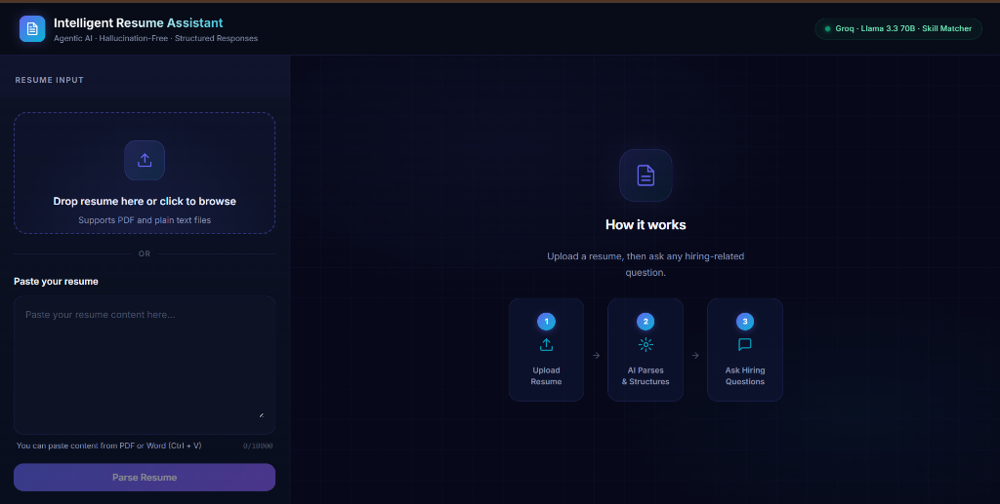
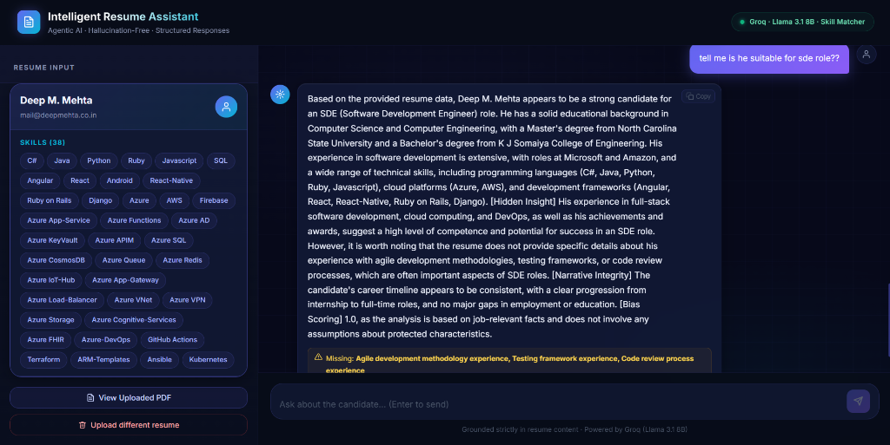
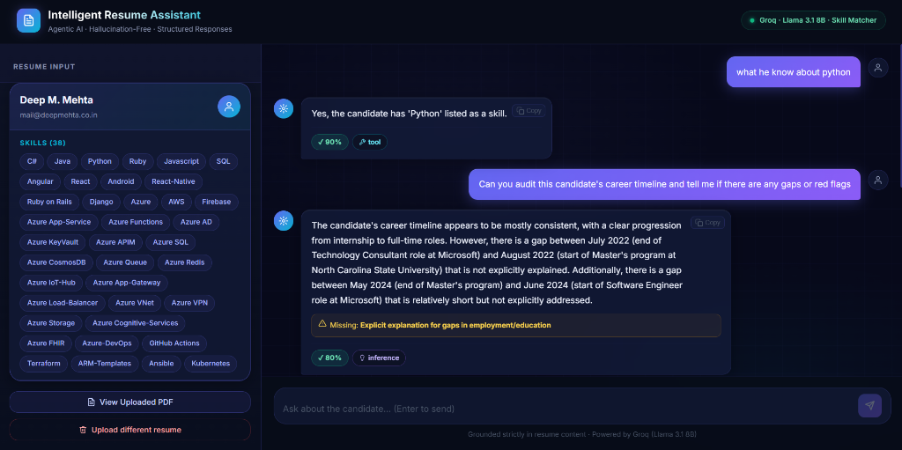
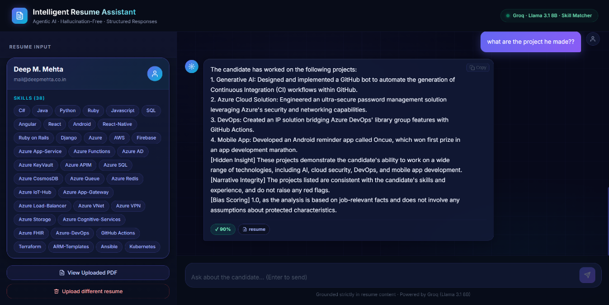
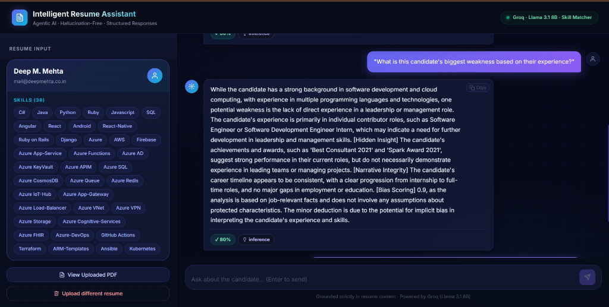

# 🧠 Intelligent Resume Assistant

  


The **Intelligent Resume Assistant** is a production-ready, agentic AI application designed for recruiters, hiring managers, and HR professionals. It allows users to upload a candidate's resume (PDF or text) and instantly interact with a highly-focused, **hallucination-free** AI agent to query the candidate's skills, experience, and qualifications.

---

## 🌟 Why We Built This

Traditional LLMs (like standard ChatGPT) suffer from a major flaw when reviewing resumes: **Hallucination**. If you ask standard AI if a candidate knows a specific skill, the AI will often guess, assume, or hallucinate based on the candidate's general job title. 

We built the Intelligent Resume Assistant to solve this problem by implementing a strict, deterministic agentic pipeline that guarantees the AI **only** answers based on what is explicitly written in the resume document. 

### Key Design Philosophies:
- **Zero Hallucination Guarantee:** The AI is strictly prompted to refuse answering if data is not present in the text.
- **Lightning Fast Inference:** By utilizing Groq's LPUs, resume parsing and chat responses happen in milliseconds.
- **Deterministic Skill Matching:** We bypass the LLM entirely for direct "Does the candidate know X?" queries, using heuristic regex and fuzzy string matching to ensure 100% accuracy.

---

## 📸 Screenshots & Capabilities

Our chat agent dynamically supports various types of analysis:

**Deep Career Evaluation & Bias Scoring**


**Narrative Integrity Audits**


**Project Extraction & Hidden Insights**


**Instant Deterministic Skill Matching**


---

## 🛠️ Technology Stack

### **Frontend (Vercel)**
- **React 18 & TypeScript:** For a robust, type-safe user interface.
- **Vite:** Next-generation frontend tooling for rapid development.
- **Axios:** For robust API communication (with custom configurations to prevent multipart boundary stripping).
- **Vanilla CSS:** Custom, modern dark-mode aesthetic featuring glassmorphism and smooth micro-animations.

### **Backend (Render)**
- **FastAPI (Python):** High-performance backend framework for handling concurrent requests.
- **Groq API:** Powering the core LLM intelligence.
- **Llama 3.3 70B Versatile:** The specific LLM model chosen for its immense reasoning capabilities and strict adherence to JSON output schemas.
- **PyPDF2:** A lightweight, memory-efficient PDF parser specifically chosen to prevent Out-Of-Memory (OOM) crashes on cloud deployment environments.

---

## 🚀 Key Features

1. **Intelligent PDF Parsing:** Automatically extracts raw text from complex PDF layouts and uses a `temperature=0.0` LLM call to structure it into strict JSON (Name, Email, Skills, Experience, etc.).
2. **Context-Aware Chat Agent:** Users can ask dynamic questions (e.g., "Is this candidate suitable for a Senior Backend role?"). The AI evaluates the structured resume data and answers with citations and a confidence score.
3. **Intent Detection System:** The backend intercepts chat messages and detects the user's intent. If the user asks a binary skill question ("Does he know Python?"), it routes the request to a deterministic Python fuzzy-matcher rather than the LLM to guarantee absolute accuracy.
4. **Cloud-Optimized Architecture:** Designed to run seamlessly within free-tier cloud constraints. Handles cold-starts gracefully and uses highly-optimized Python dependencies to respect tight memory limits (512MB RAM).

---

## 🏗️ Architecture & Flow

1. **Upload Phase:** 
   - Browser sends `multipart/form-data` to FastAPI.
   - FastAPI uses `PyPDF2` to extract raw string data.
   - Groq API is called to format the string into a structured `Resume` JSON object.
   - A unique `session_id` is generated and stored in-memory.
2. **Chat Phase:**
   - User types a prompt.
   - `agent.py` detects the intent of the prompt.
   - If a standard question, it retrieves the `session_id` memory and passes the history + the parsed JSON resume to the `llama-3.3-70b-versatile` model.
   - The model returns a structured JSON answer, which is parsed by FastAPI and sent back to the React frontend.

---

## ⚙️ Local Development Setup

### 1. Clone the repository
```bash
git clone https://github.com/DEVESH859/Intelligent-Resume-Assistant.git
cd Intelligent-Resume-Assistant
```

### 2. Backend Setup
```bash
cd backend
python -m venv venv
source venv/bin/activate  # On Windows: venv\Scripts\activate
pip install -r requirements.txt
```
Create a `.env` file in the `backend` directory:
```env
GROQ_API_KEY=your_groq_api_key_here
```

### 3. Frontend Setup
```bash
cd ../frontend
npm install
```
Create a `.env.local` file in the `frontend` directory:
```env
VITE_API_URL=http://localhost:8000
```

### 4. Run the Application
You can start both the frontend and backend simultaneously by running the provided batch script from the root directory:
```cmd
start.bat
```

---

## ☁️ Deployment Log & Decisions

- **Why PyPDF2 instead of pdfplumber?** Initially, the app used `pdfplumber` for advanced extraction. However, `pdfplumber` frequently exceeded the 512MB RAM limit on Render's free tier, causing the server to silently crash and throw 502/Network Errors. Switching to `PyPDF2` resolved all memory-related deployment crashes.
- **CORS & Axios Fix:** Explicit `Content-Type` headers were removed from Axios file uploads to allow the browser to auto-generate multipart boundaries, preventing mysterious connection drops in production.
- **Vercel Env Vars:** The frontend falls back to the hardcoded Render URL to ensure robust production connectivity even if Vercel build environment variables fail to inject properly.
